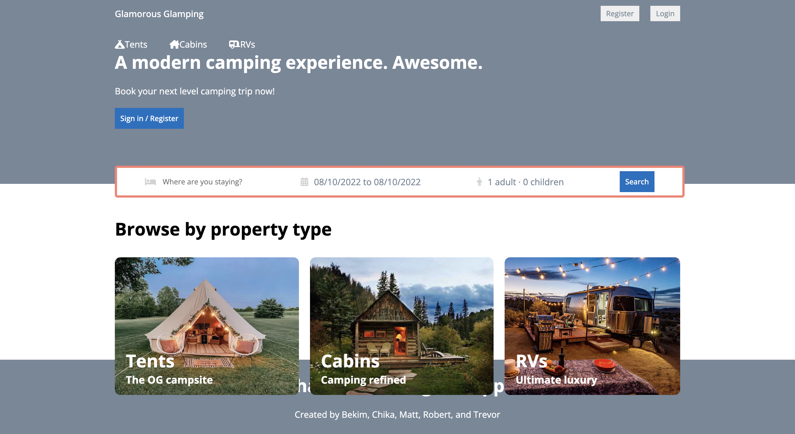

## MERN SPA Project

## Description

In this app we had to make an interactive MERN project using react for the front end with a combination of MONGODB and GraphQl for the backend.

## Built With

- HTML
- CSS
- React.js
- MongoDB
- GraphQl

## Application Deployed

https://glamorous-glamping.herokuapp.com/rvs

## Screenshot

### Created by Bekim, Chika, Matt, Robert, and Trevor
